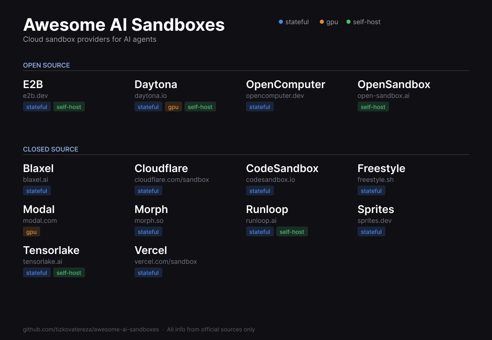

# Awesome AI Sandboxes

A curated list of cloud sandbox providers for AI agents.

All information sourced exclusively from official docs and landing pages. PRs welcome, but please link to official sources only.

> **Why this list?** There's a lot of noise and inaccurate info about sandbox providers online. This repo exists to fix that. Every claim here links back to the provider's own docs or landing page.

### Labels

`open-source` `stateful` `gpu` `self-host`

---

## Open Source

### [E2B](https://e2b.dev) `stateful` `self-host`
[Website](https://e2b.dev) | [Docs](https://e2b.dev/docs) | [GitHub](https://github.com/e2b-dev/E2B)

Secure cloud sandboxes for AI agents with real-world tools. Powered by Firecracker microVMs.

- **Isolation:** Firecracker microVMs
- **Key features:** Code interpreter SDK, custom sandbox templates, desktop sandboxes (computer use), up to 24h sessions, filesystem & network access, sub-200ms cold starts
- **Stateful:** Yes, persistent full environments, not just code execution
- **SDKs:** Python, JavaScript/TypeScript
- **License:** Apache 2.0
- **Pricing:** Free tier available, pay-as-you-go

---

### [Daytona](https://daytona.io) `stateful` `gpu` `self-host`
[Website](https://daytona.io) | [Docs](https://daytona.io/docs) | [GitHub](https://github.com/daytonaio/daytona)

Secure and elastic infrastructure for running AI-generated code. Sub-90ms sandbox creation.

- **Isolation:** Secure isolated runtimes
- **Key features:** Sub-90ms creation, massive parallelization, file/git/LSP/execute APIs, environment snapshots, computer use (Linux, macOS, Windows), Docker-in-Docker, volumes for shared data
- **Stateful:** Yes, sandboxes run indefinitely, built for long-running and persistent agents
- **SDKs:** Python, TypeScript
- **License:** Apache 2.0
- **Pricing:** Pay-as-you-go per second, $200 free compute included

---

### [OpenComputer](https://opencomputer.dev) `stateful`
[Website](https://opencomputer.dev) | [Docs](https://docs.opencomputer.dev) | [GitHub](https://github.com/diggerhq/opencomputer)

Persistent cloud VMs for AI agents by Digger. Full Linux machines that hibernate when idle and wake in seconds.

- **Isolation:** Full VMs with own filesystem, network, and process space
- **Key features:** Always-on persistent VMs, elastic compute (resize CPU/memory at runtime), hibernate & wake, instant checkpoints (snapshot/fork/rollback), 20GB disk per VM
- **Stateful:** Yes, state survives across sessions, VMs stay alive until explicitly stopped
- **SDKs:** API-based (works with Claude Agent SDK and others)
- **Pricing:** Pay-per-minute, pre-booked ($0.024/h) or instant ($0.12/h) for 2GB/1vCPU

---

### [OpenSandbox](https://open-sandbox.ai) (by Alibaba) `self-host`
[Website](https://open-sandbox.ai) | [GitHub](https://github.com/alibaba/OpenSandbox)

Production-grade sandbox runtime for AI agents.

- **Isolation:** Docker/Kubernetes runtimes
- **Key features:** Unified sandbox APIs, supports coding agents, GUI agents, agent evaluation, AI code execution, and RL training
- **License:** Apache 2.0
- **Pricing:** Free (open source)

---

## Closed Source

### [Blaxel](https://blaxel.ai) `stateful`
[Website](https://blaxel.ai) | [Docs](https://docs.blaxel.ai) | [GitHub](https://github.com/blaxel-ai)

The perpetual sandbox platform. Sandboxes auto-suspend when idle and resume from standby in ~25ms with full memory state.

- **Isolation:** Individual microVMs with root filesystem in memory
- **Key features:** 25ms resume from standby, auto-suspend to $0 compute, 50k+ concurrent sandboxes, Agent Drive (distributed filesystem), volumes for long-term data, agent + MCP server co-hosting on same backbone
- **Stateful:** Yes, full memory + filesystem snapshot on suspend, persists forever
- **SDKs:** TypeScript, Python
- **Pricing:** Pay for active compute only, $0 on standby. SOC 2, HIPAA, ISO 27001

---

### [Cloudflare Dynamic Workers](https://developers.cloudflare.com/dynamic-workers/)
[Docs](https://developers.cloudflare.com/dynamic-workers/) | [Blog](https://blog.cloudflare.com/dynamic-workers/)

V8 isolate-based sandboxing for AI-generated code. Millisecond startup, 100x faster than containers.

- **Isolation:** V8 isolates (not VMs or containers)
- **Key features:** Millisecond cold starts, unlimited Workers spun up at runtime, network access control, Durable Object Facets with isolated SQLite storage, custom resource limits, tail workers for observability
- **Stateful:** Optional via Durable Object Facets with isolated persistent state
- **SDKs:** JavaScript/TypeScript (Workers runtime)
- **Pricing:** $0.002 per unique Worker loaded per day + standard Workers CPU/invocation charges

---

### [CodeSandbox](https://codesandbox.io) `stateful`
[Website](https://codesandbox.io) | [Docs](https://codesandbox.io/docs) | [GitHub](https://github.com/codesandbox)

Cloud sandbox platform (now part of Together AI) for isolated microVM environments for AI agents.

- **Isolation:** MicroVM-based sandboxes
- **Key features:** Snapshot/restore in <2s, VM cloning in <2s, millions of concurrent VMs, customizable hibernation, forking for A/B testing agents, SOC 2 Type II
- **Stateful:** Yes, snapshot and restore
- **SDKs:** TypeScript/JavaScript (`@codesandbox/sdk`)
- **Pricing:** Free tier (40h VM credits/month), Scale from $170/month

---

### [Fly.io Machines](https://fly.io) `stateful` `gpu`
[Website](https://fly.io) | [Docs](https://fly.io/docs) | [GitHub](https://github.com/superfly)

Hardware-virtualized micro VMs that launch in subseconds across 18+ global regions.

- **Isolation:** Hardware-virtualized VMs (Firecracker-based)
- **Key features:** Subsecond start/stop, Sprites (hardware-isolated sandboxes for AI code with checkpointing), 18+ regions, REST API and CLI, built-in private networking
- **Stateful:** Yes, persistent volumes and Sprites with checkpointing
- **SDKs:** REST API (language-agnostic), CLI (`flyctl`)
- **Pricing:** Pay-as-you-go per second, from ~$2/month for smallest VM

---

### [Modal](https://modal.com) `gpu`
[Website](https://modal.com) | [Docs](https://modal.com/docs) | [GitHub](https://github.com/modal-labs)

Serverless cloud platform for AI with sandboxes, GPU compute, and sub-second cold starts.

- **Isolation:** Sandboxes with ephemeral isolated environments
- **Key features:** Pay-per-second billing, GPU support (H100, A100, L40S, etc.), sub-second container boots, autoscale 0 to 1000+ GPUs, SOC2 & HIPAA compliant
- **Stateful:** Sandboxes are ephemeral; volumes available for persistence
- **SDKs:** Python (primary), TypeScript/Go via libmodal
- **Pricing:** Pay-as-you-go, $30/month free credits on Starter plan

---

### [Morph](https://morph.so) `stateful`
[Website](https://morph.so) | [GitHub](https://github.com/morph-labs)

Cloud infrastructure for AI agents with instant environment branching and burst scalability.

- **Isolation:** Full VM instances (not containers)
- **Key features:** Instant environment branching and snapshot/restore, burst scalability (millisecond deploys), used for SWE-Bench, RL rollouts, and computer-use agents
- **Stateful:** Yes, snapshot and restore
- **SDKs:** Python, TypeScript
- **Pricing:** Not publicly listed

---

### [Runloop](https://runloop.ai) `stateful` `self-host`
[Website](https://runloop.ai) | [Docs](https://docs.runloop.ai) | [GitHub](https://github.com/runloopai)

Devbox infrastructure for building, benchmarking, and shipping AI coding agents at enterprise scale.

- **Isolation:** Micro-VM sandboxes on custom bare-metal hypervisor
- **Key features:** 2x faster vCPUs, sub-2s startup for 10GB images, 10k+ parallel sandboxes, snapshot/branch state (Git for Agent State), suspend & resume, built-in SWE-Bench
- **Stateful:** Yes, snapshot and branch sandbox state
- **SDKs:** Python, TypeScript
- **Pricing:** Free tier with $50 credits, usage-based compute

---

## Contributing

Want to add a provider or fix an error? Open a PR with a link to the provider's official documentation or landing page as the source.

**Rules:**
1. All information must come from official sources (docs, landing pages, official GitHub repos)
2. No blog posts, tweets, or third-party articles as primary sources
3. Keep entries factual, no marketing fluff

## License

[CC BY-NC-SA 4.0](LICENSE.md)
